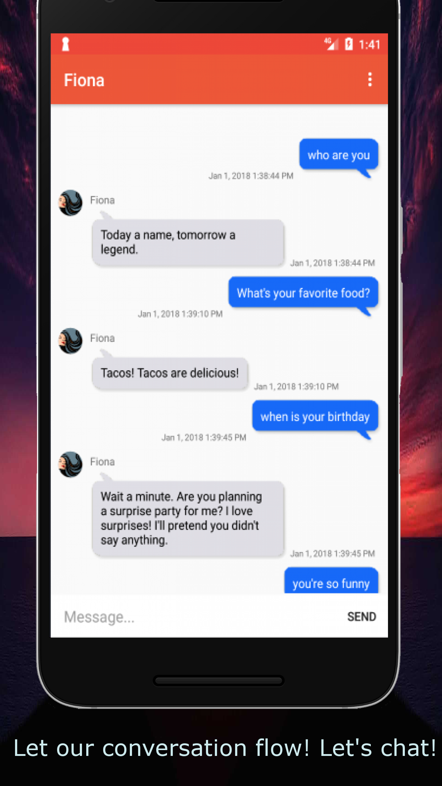
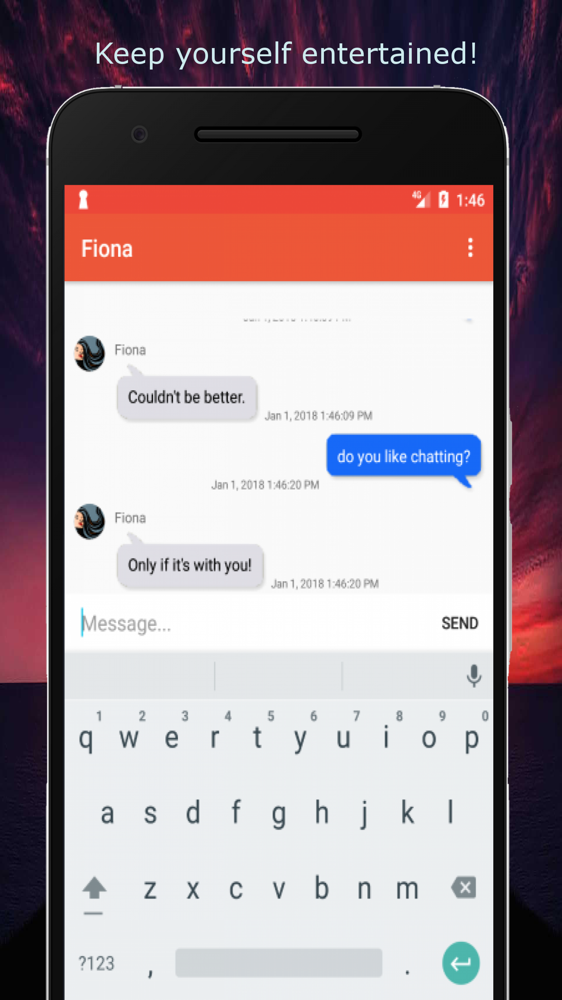

# android-aws-architecture-components-dialogflow-chatbot

Android chatbot using: 

* ***Dialogflow (Api.ai)*** for machine learning & NLP

* ***AWS DynamoDB NoSQL database*** for storage with ***DynamoDB Object Mapper*** (lets us map client-side classes to DynamoDB tables, perform CRUD operations, and execute queries)

* ***AWS Cognito Identity*** to create unique identities for users and authenticate them for secure access to DynamoDB

* ***Android Architecture Components:*** 

   * ***Room Persistence Library*** (provides an abstraction layer over SQLite) (compile-time verification of raw SQL queries, supports observable queries which return LiveData objects)

   * ***ViewModel*** (exposes the required data and interested parties can listen to it) (ViewModels do not contain code related to the UI. This helps in the decoupling of our app components) (also allows data to survive configuration changes such as screen rotations.
)

   * ***LiveData*** (an observable data holder class) (it's lifecycle-aware, ensuring LiveData only updates app component observers that are in an active lifecycle state.)

# Fiona AI Chat

Keep yourself entertained! Talk about anything with Fiona, as she grows smarter with every interaction. 

  

## Screenshots

#### Contributing

###### Code & Issues
If you wish to contribute to the app please fork the project
and submit a pull request. If possible make the PR on the [develop branch](https://github.com/VeeShostak/android-aws-architecture-components-dialogflow-chatbot/tree/develop).

You can trace the status of known issues on [Github Issues](https://github.com/VeeShostak/android-aws-architecture-components-dialogflow-chatbot/issues),

#### Licensing
Fiona AI Chat is licensed under the [MIT License](https://github.com/VeeShostak/android-aws-architecture-components-dialogflow-chatbot/blob/master/LICENSE).
